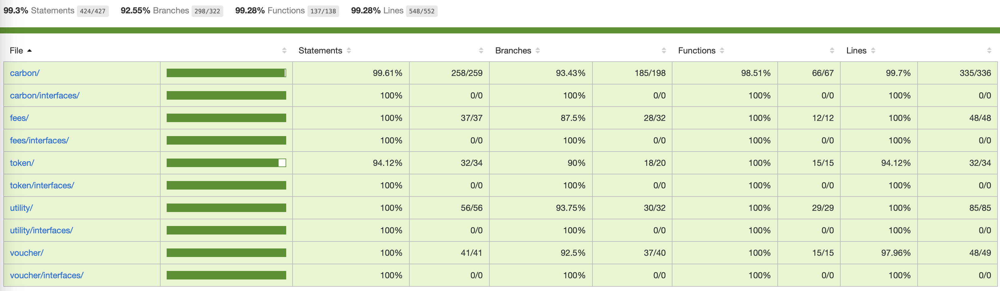



# Carbon v1.0

[](https://github.com/bancorprotocol/carbon-contracts/actions/workflows/ci.yml)

## Overview

Carbon is a fully decentralized protocol for automating on-chain trading strategies.

Some examples of the advanced features Carbon offers:

-   Linked limit & ranged orders
-   Automated Strategies
-   Non-custodial and fully decentralized
-   Asymmetric & Irreversible Liquidity
-   All standard ERC-20 tokens supported (excluding rebase/fee-on-transfer tokens)
-   MEV Resistant

## Security

The repository is part of the bug bounty program.
See the details [here](./docs/bug-bounty.md).

The security policy is available [here](./SECURITY.md).

### Security Audits

-   [ChainSecurity](docs/audits/ChainSecurity_Carbon_Audit_Report.pdf)
-   [PeckShield](docs/audits/PeckShield-Audit-Report-Carbon-v1.0.pdf)

## Setup

As a first step of contributing to the repo, you should install all the required dependencies via:

```sh
yarn install
```

You will also need to create and update the `.env` file if you’d like to interact or run the unit tests against mainnet forks (see [.env.example](./.env.example))

## Testing

Testing the protocol is possible via multiple approaches:

### Unit Tests

You can run the full test suite via:

```sh
yarn test
```

You can also run the test suite with additional stress tests via:

```sh
yarn test:nightly
```

This suite is called “nightly” since it’s scheduled to run every day at midnight against the release and production branches (see [nightly.yml](.github/workflows/nightly.yml)).

### Deployment Tests

You can test new deployments (and the health of the network) against a mainnet fork via:

```sh
yarn test:deploy
```

This will automatically be skipped on an already deployed and configured deployment scripts and will only test the additional changeset resulting by running any new/pending deployment scripts and perform an e2e test against the up to date state. This is especially useful to verify that any future deployments and upgrades, suggested by the DAO, work correctly and preserve the integrity of the system.

### Test Coverage

#### Latest Test Coverage Report (2023-06-08)

-   99.3% Statements 424/427
-   92.55% Branches 298/322
-   99.28% Functions 137/138
-   99.28% Lines 548/552



```sh
------------------------|----------|----------|----------|----------|----------------|
File                    |  % Stmts | % Branch |  % Funcs |  % Lines |Uncovered Lines |
------------------------|----------|----------|----------|----------|----------------|
 carbon/                |    99.61 |    93.43 |    98.51 |     99.7 |                |
  CarbonController.sol  |    98.67 |    89.77 |    96.55 |    98.84 |             94 |
  Pairs.sol             |      100 |    85.71 |      100 |      100 |                |
  Strategies.sol        |      100 |    97.92 |      100 |      100 |                |
 carbon/interfaces/     |      100 |      100 |      100 |      100 |                |
  ICarbonController.sol |      100 |      100 |      100 |      100 |                |
 fees/                  |      100 |     87.5 |      100 |      100 |                |
  FeeBurner.sol         |      100 |     87.5 |      100 |      100 |                |
 fees/interfaces/       |      100 |      100 |      100 |      100 |                |
  IFeeBurner.sol        |      100 |      100 |      100 |      100 |                |
 token/                 |    94.12 |       90 |      100 |    94.12 |                |
  ERC20Burnable.sol     |      100 |      100 |      100 |      100 |                |
  Token.sol             |    93.55 |       90 |      100 |    93.55 |         92,142 |
 token/interfaces/      |      100 |      100 |      100 |      100 |                |
  IERC20Burnable.sol    |      100 |      100 |      100 |      100 |                |
 utility/               |      100 |    93.75 |      100 |      100 |                |
  Constants.sol         |      100 |      100 |      100 |      100 |                |
  MathEx.sol            |      100 |      100 |      100 |      100 |                |
  OnlyProxyDelegate.sol |      100 |      100 |      100 |      100 |                |
  Upgradeable.sol       |      100 |       75 |      100 |      100 |                |
  Utils.sol             |      100 |      100 |      100 |      100 |                |
 utility/interfaces/    |      100 |      100 |      100 |      100 |                |
  IUpgradeable.sol      |      100 |      100 |      100 |      100 |                |
  IVersioned.sol        |      100 |      100 |      100 |      100 |                |
 voucher/               |      100 |     92.5 |      100 |    97.96 |                |
  Voucher.sol           |      100 |     92.5 |      100 |    97.96 |            249 |
 voucher/interfaces/    |      100 |      100 |      100 |      100 |                |
  IVoucher.sol          |      100 |      100 |      100 |      100 |                |
------------------------|----------|----------|----------|----------|----------------|
All files               |     99.3 |    92.55 |    99.28 |    99.28 |                |
------------------------|----------|----------|----------|----------|----------------|
```

#### Instructions

In order to audit the test coverage of the full test suite, run:

```sh
yarn test:coverage
```

It’s also possible to audit the test coverage of the deployment unit-tests only (which is especially useful when verifying that any future deployments and upgrades are properly covered and tested before the DAO can consider to execute them):

```sh
yarn test:coverage:deploy
```

Similarly to the regular test suite, it’s also possible to audit the test coverage of the stress test suite via:

```sh
yarn test:coverage:nightly
```

## Deployments

The contracts have built-in support for deployments on different chains and mainnet forks, powered by the awesome [hardhat-deploy](https://github.com/wighawag/hardhat-deploy) framework (tip of the hat to @wighawag for the crazy effort him and the rest of the contributors have put into the project).

You can deploy the fully configured Carbon protocol via:

```sh
yarn deploy
```

There’s also a special deployment mode which deploys the protocol to a mainnet fork. It can be run via:

```sh
yarn deploy:fork
```

## Community

-   [Twitter](https://twitter.com/carbondefixyz)
-   [Telegram](https://t.me/CarbonDeFixyz)
-   [Discord](https://discord.gg/aMVTbrmgD7)
-   [YouTube](https://www.youtube.com/c/BancorProtocol)
